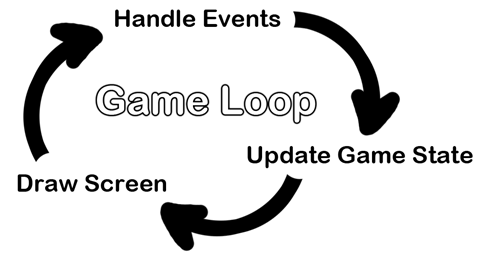
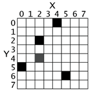

# <center>**[Cool Kids Coding School](https://www.coolkidscodingschool.com)**</center>
---
## Game Programming with Python<br> Lesson 01: Introduction to PyGame

![alt text][logo]

[logo]: ./images/ckcslogo.png

---

> 1.0 Overview

In this lesson we are going to start learning how to create games using Python.  As we have seen in previous courses, python comes with many packages built in.  This is what makes python such a great development language.  One of these packages is focused on game development.  The **Pygame** framework includes several modules with functions for drawing graphics, playing sounds, handling mouse input, and other things.

> 2.0 GUI vs. CLI

The Python programs that we have been writing up to this point use built-in functions that only deal with text through the print() and input() functions.  This type of program has a command line interface, or **CLI**.

Pygame provides functions for creating programs with a graphical user interface, or **GUI** (pronounced, “gooey”). Instead of a text-based CLI, programs with a graphics-based GUI can show a window with images and colors.

> 3.0 Hello World with Pygame

Our first program made with Pygame is a small program that makes a window that says “Hello World!” appear on the screen. Open a new REPL and select "Python with Pygame" as the REPL type.

```python
import pygame

pygame.init()
surface = pygame.display.set_mode((400, 300))

pygame.display.set_caption('Hello World!')

# main game loop
done = False
while not done:
    # go through the event queue
    for event in pygame.event.get():
        if event.type == pygame.QUIT:
            done = True

    pygame.display.update()

pygame.quit()
```

You’ve just made the world’s most boring video game! It’s just a blank window with “Hello World!” at the top of the window (in what is called the window’s title bar, which holds the caption text). Creating a window is the first step to making graphical games. When you click on the X button in the corner of the window, the program will end and the window will disappear.

For now, let’s look at each line in our “Hello World” program in more detail.

```python
import pygame
```

This is the package that holds all the functionality we will need to create our game.  It is always the first line

```python
pygame.init()
```

Here we are calling the init() function in the pygame package.  This line always needs to be called after importing the pygame package before any other pygame functions are used.  What it does is initialize the whole pygame framework.  The details are not important at this level.

```python
surface = pygame.display.set_mode((400, 300))
```

This line is a call to the pygame.display.set_mode() function, which returns the pygame.Surface object for the window. Notice that we pass a tuple value of two integers to the function: (400, 300). This tuple tells the set_mode() function how wide and how high to make the window in pixels. (400, 300) will make a window with a width of 400 pixels and height of 300 pixels.

The pygame.Surface object returned is stored in a variable named surface.

```python
pygame.display.set_caption('Hello World!')
```

The next line sets the caption text that will appear at the top of the window by calling the pygame.display.set_caption() function. The string value 'Hello World!' is passed in this function call to make that text appear as the caption.

```python
done = False
while not done:
```

This code segment is a while loop that has a condition which is usually True. This means that it never exits unless the done variable becomes False.

The games we will build all have these while loops in them along with a comment calling it the “main game loop”. A game loop (also called a main loop) is a loop where the code does three things:

+ Handles events.
+ Updates the game state.
+ Draws the game state to the screen.

The game state is simply a way of referring to a set of values for all the variables in a game program. In many games, the game state includes the values in the variables that tracks the player’s health and position, the health and position of any enemies, which marks have been made on a board, the score, or whose turn it is. Whenever something happens like the player taking damage (which lowers their health value), or an enemy moves somewhere, or something happens in the game world we say that the game state has changed.

Since the game state is usually updated in response to events (such as mouse clicks or keyboard presses) or the passage of time, the game loop is constantly checking and re-checking many times a second for any new events that have happened. Inside the main loop is code that looks at which events have been created (with Pygame, this is done by calling the pygame.event.get() function). The main loop also has code that updates the game state based on which events have been created. This is usually called event handling.



> 4.0 pygame.event.Event Objects

Any time the user does one of several actions such as pressing a keyboard key or moving the mouse on the program’s window, a pygame.event.Event object is created by the Pygame library to record this “event”. We can find out which events have happened by calling the pygame.event.get() function, which returns a list of pygame.event.Event objects.

The list of Event objects will be for each event that has happened since the last time the pygame.event.get() function was called.

```python
    # go through the event queue
    for event in pygame.event.get():
        if event.type == pygame.QUIT:
            done = True
```

Event objects have a member variable (also called attributes or properties) named type which tells us what kind of event the object represents. This code segment checks if the Event object’s type is equal to QUIT.

If the Event object is a quit event, then we set the done variable to True.  This will cause the game loop to stop at the next iteration.

Since we have no if statements that run code for other types of Event object, there is no event-handling code for when the user clicks the mouse, presses keyboard keys, or causes any other type of Event objects to be created. The user can do things to create these Event objects but it doesn’t change anything in the program because the program does not have any event-handling code for these types of Event objects. After the for loop is done handling all the Event objects that have been returned by pygame.event.get(), the program execution continues to the next line.

```python
pygame.display.update()
```

This next line calls the pygame.display.update() function, which draws the Surface object returned by pygame.display.set_mode() to the screen (remember we stored this object in the surface variable). Since the Surface object hasn’t changed, the same black image is redrawn to the screen each time pygame.display.update() is called.

```python
pygame.quit()
```

This line of code is executed as soon as we exit the game loop.  The pygame.quit() function is sort of the opposite of the pygame.init() function: it runs code that deactivates the Pygame library. Your programs should always call pygame.quit() before they exit to terminate the program.

That is the entire program. This program does nothing besides make a black window appear on the screen, constantly check for a QUIT event, and then redraws the unchanged black window to the screen over and over again. Let’s learn how to make interesting things appear on this window instead of just blackness by learning about pixels, Surface objects, Color objects, Rect objects, and the Pygame drawing functions.

> 5.0 Pixel Coordinates

The window that the “Hello World” program creates is just composed of little square dots on your screen called pixels. Each pixel starts off as black but can be set to a different color. Imagine that instead of a Surface object that is 400 pixels wide and 300 pixels tall, we just had a Surface object that was 8 pixels by 8 pixels. If that tiny 8x8 Surface was enlarged so that each pixel looks like a square in a grid, and we added numbers for the X and Y axis, then a good representation of it could look something like this:



We can refer to a specific pixel by using a Cartesian Coordinate system. Each column of the X-axis and each row of the Y-axis will have an “address” that is an integer from 0 to 7 so that we can locate any pixel by specifying the X and Y axis integers.

For example, in the above 8x8 image, we can see that the pixels at the XY coordinates (4, 0), (2, 2), (0, 5), and (5, 6) have been painted black, the pixel at (2, 4) has been painted gray, while all the other pixels are painted white. XY coordinates are also called points. If you’ve learned about Cartesian Coordinates, you might notice that the Y-axis starts at 0 at the top and then increases going down, rather than increasing as it goes up. This is just how Cartesian Coordinates work in Pygame.

> 6.0 Surface Objects and The Window

Surface objects are objects that represent a rectangular 2D image. The pixels of the Surface object can be changed by calling the Pygame drawing functions (described later in this chapter) and then displayed on the screen. The window border, title bar, and buttons are not part of the display Surface object.

In particular, the Surface object returned by pygame.display.set_mode() is called the display Surface. Anything that is drawn on the display Surface object will be displayed on the window when the pygame.display.update() function is called.

Often your program will draw several different things to a Surface object. Once you are done drawing everything on the display Surface object for this iteration of the game loop (called a frame, just like a still image on a paused DVD is called) on a Surface object, it can be drawn to the screen. The computer can draw frames very quickly, and our programs will often run around 30 frames per second (that is, 30 FPS).

> 7.0 Colors

There are three primary colors of light: red, green and blue. By combining different amounts of these three colors you can form any other color. In Pygame, we represent colors with tuples of three integers. The first value in the tuple is how much red is in the color. An integer value of 0 means there is no red in this color, and a value of 255 means there is the maximum amount of red in the color. The second value is for green and the third value is for blue. These tuples of three integers used to represent a color are often called RGB values.

Because you can use any combination of 0 to 255 for each of the three primary colors, this means Pygame can draw 16,777,216 different colors (that is, 256 x 256 x 256 colors).

Here are the RGB values for a few common colors:
|Color|RGB Values|
|-----|----------|
|Aqua|(  0, 255, 255)|
|Black|(  0,   0,   0)|
|Blue|(  0,  0, 255)|
|Fuchsia|(255,   0, 255)|
|Gray|(128, 128, 128)|
|Green|(  0, 128,   0)|
|Lime|(  0, 255,   0)|
|Maroon|(128,  0,   0)|
|Navy Blue|(  0,  0, 128)|
|Olive|(128, 128,   0)|
|Purple|(128,  0, 128)|
|Red|(255,   0,   0)|
|Silver|(192, 192, 192)|
|Teal|(  0, 128, 128)|
|White|(255, 255, 255)|
|Yellow|(255, 255,   0)|

> 8.0 Rect Objects

Pygame represents rectangular areas as a tuple of four integers:

+ The X coordinate of the top left corner.
+ The Y coordinate of the top left corner.
+ The width (in pixels) of the rectangle.
+ Then height (in pixels) of the rectangle.

```pygame
spamRect = pygame.Rect(10, 20, 200, 300)
```

The handy thing about this is that the Rect object automatically calculates the coordinates for other features of the rectangle. For example, if you need to know the X coordinate of the right edge of the pygame.Rect object we stored in the spamRect variable, you can just access the Rect object’s right attribute:

```python
spamRect.right
```

210

The Pygame code for the Rect object automatically calculated that if the left edge is at the X coordinate 10 and the rectangle is 200 pixels wide, then the right edge must be at the X coordinate 210. If you reassign the right attribute, all the other attributes are automatically recalculated:

```pygame
spamRect.right = 350
spamRect.left
```

150

Here’s a list of all the attributes that pygame.Rect objects provide:

|Attribute Name|Description|
|--------------|-----------|
|myRect.left|The int value of the X-coordinate of the left side of the rectangle.|
|myRect.right|The int value of the X-coordinate of the right side of the rectangle.|
|myRect.top|The int value of the Y-coordinate of the top side of the rectangle.|
|myRect.bottom|The int value of the Y-coordinate of the bottom side.|
|myRect.centerx|The int value of the X-coordinate of the center of the rectangle.|
|myRect.centery|The int value of the Y-coordinate of the center of the rectangle.|
|myRect.width|The int value of the width of the rectangle.|
|myRect.height|The int value of the height of the rectangle.|
|myRect.size|A tuple of two ints: (width, height)|
|myRect.topleft|A tuple of two ints: (left, top)|
|myRect.topright|A tuple of two ints: (right, top)|
|myRect.bottomleft|A tuple of two ints: (left, bottom)|
|myRect.bottomright|A tuple of two ints: (right, bottom)|
|myRect.midleft|A tuple of two ints: (left, centery)|
|myRect.midright|A tuple of two ints: (right, centery)|
|myRect.midtop|A tuple of two ints: (centerx, top)|
|myRect.midbottom|A tuple of two ints: (centerx, bottom)|

> 8.0 Primitive Drawing Functions

Pygame provides several different functions for drawing different shapes onto a surface object. These shapes such as rectangles, circles, ellipses, lines, or individual pixels are often called drawing primitives.

```python
import pygame

pygame.init()

# set up the window
surface = pygame.display.set_mode((500, 400), 0, 32)
pygame.display.set_caption('Drawing')

# set up the colors
BLACK = (  0,   0,   0)
WHITE = (255, 255, 255)
RED = (255,   0,   0)
GREEN = (  0, 255,   0)
BLUE = (  0,   0, 255)

# draw on the surface object
surface.fill(WHITE)

pygame.draw.polygon(surface, GREEN, ((146, 0), (291, 106), (236, 277), (56, 277), (0, 106)))
pygame.draw.line(surface, BLUE, (60, 60), (120, 60), 4)
pygame.draw.line(surface, BLUE, (120, 60), (60, 120))
pygame.draw.line(surface, BLUE, (60, 120), (120, 120), 4)
pygame.draw.circle(surface, BLUE, (300, 50), 20, 0)
pygame.draw.rect(surface, RED, (200, 150, 100, 50))

# run the game loop
done = False
while not done:
    for event in pygame.event.get():
        if event.type == QUIT:
            done = True

    pygame.display.update()

pygame.quit()
```

+ fill(color) – The fill() method is not a function but a method of pygame.Surface objects. It will completely fill in the entire Surface object with whatever color value you pass as for the color parameter.

+ pygame.draw.polygon(surface, color, pointlist, width) – A polygon is shape made up of only flat sides. The surface and color parameters tell the function on what surface to draw the polygon, and what color to make it.  The polygon is drawn by drawing lines between each point and the point that comes after it in the tuple. Then a line is drawn from the last point to the first point. You can also pass a list of points instead of a tuple of points.

The width parameter is optional. If you leave it out, the polygon that is drawn will be filled in.  If you do pass an integer value for the width parameter, only the outline of the polygon will be drawn. The integer represents how many pixels width the polygon’s outline will be. Passing 1 for the width parameter will make a skinny polygon, while passing 4 or 10 or 20 will make thicker polygons. If you pass the integer 0 for the width parameter, the polygon will be filled in (just like if you left the width parameter out entirely).

All of the pygame.draw drawing functions have optional width parameters at the end, and they work the same way as pygame.draw.polygon()’s width parameter. Probably a better name for the width parameter would have been thickness, since that parameter controls how thick the lines you draw are.

+ pygame.draw.line(surface, color, start_point, end_point, width) – This function draws a line between the start_point and end_point parameters.

+ pygame.draw.lines(surface, color, closed, pointlist, width) – This function draws a series of lines from one point to the next, much like pygame.draw.polygon(). The only difference is that if you pass False for the closed parameter, there will not be a line from the last point in the pointlist parameter to the first point. If you pass True, then it will draw a line from the last point to the first.

+ pygame.draw.circle(surface, color, center_point, radius, width) – This function draws a circle. The center of the circle is at the center_point parameter. The integer passed for the radius parameter sets the size of the circle.  The radius of a circle is the distance from the center to the edge. (The radius of a circle is always half of the diameter.) Passing 20 for the radius parameter will draw a circle that has a radius of 20 pixels.

+ pygame.draw.rect(surface, color, rectangle_tuple, width) – This function draws a rectangle. The rectangle_tuple is either a tuple of four integers (for the XY coordinates of the top left corner, and the width and height) or a pygame.Rect object can be passed instead. If the rectangle_tuple has the same size for the width and height, a square will be drawn.

---

## **Any Questions?**

### **for any questions contact hw_help@coolkidscodingschool.com**
