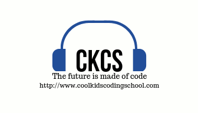

---

<H1 align=left><a href="http://www.coolkidscodingschool.com">Cool Kids Coding School</a></H1>
<H2 align=left>Course: <strong>Game Programming</strong></H1>
<H3 align=left>Lesson 5: <strong>(Homework) Sprites</strong></H3>

---

> Assignment

In this homework the student will be required to modify the REPL we worked on in class. In this REPL homework the student will add the following:  

+ change the FPS to 60, this will allow the sprite to move twice as fast
+ change the code so that when the sprite bumps into the right wall it starts moving to the left
+ change the code so that when the sprite bumps into the left wall it starts moving to the right
+ find a new image file and use it for your sprite

> This homework is due at the beginning of the next class and will be the first thing we go over.
---

## **Any Questions?**

### **for any questions contact hw_help@coolkidscodingschool.com**
